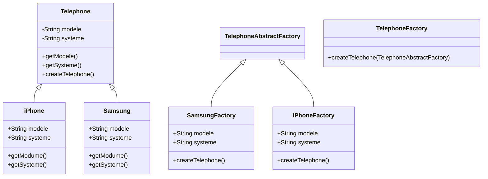
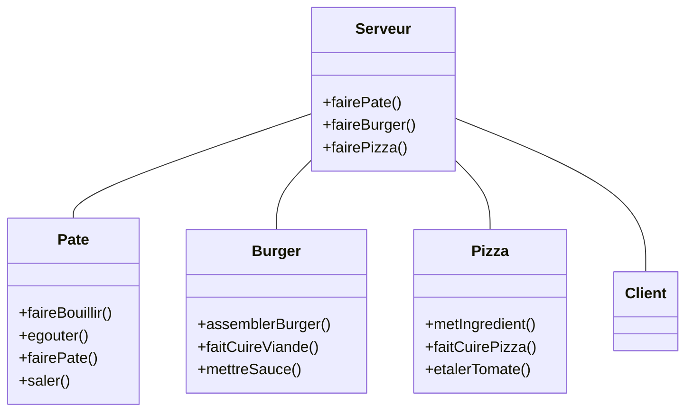

# Abstract Factory

### *Le saviez-vous ?*

Très bonne question, en réalité ça permet principalement de différencier le constructeur de l'objet en lui même.
 On passe par des classes crées pour instancier les objets plutôt que d'instancier les objets avec leur propre contructeur

Le probleme interviens lorsque l'on rajoute des sous classe concrètes : il faut alors modifier notre classe abstraite 
gérant nos sous classes, ce qui peut être (très) long. On ajoute alors une interface qui contient toutes les signatures 
des classes concrète, afin de définir nos objets.

# Facade

### *Le saviez-vous?*

En voilà une question intéressante Jami, une façade permet au client d’utiliser simplement le code alors que beaucoup de choses se passent en arrière-plan.
C’est une interface, par exemple si je veux générer un cercle, je demande à la façade de faire un cercle, derrière 
l’action “faire une cercle” va utiliser différentes méthodes pour aboutir au résultat voulu par l'utilisateur.
Autre exemple, dans un restaurant, vous êtes le client et le serveur est la façade faisant le lien entre vous, 
le client, et la cuisine qui crée votre demande grâce à différentes méthodes.

